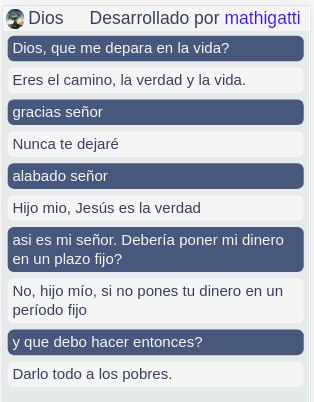

# GPT-2 Chatbot

This is a basic chatbot using GPT-2. The chatbot is in english but it uses google translate to work in spanish (You can change it to any other language [here](https://github.com/mathigatti/gpt-2-chatbot/blob/master/app.py#L37)). The personality of the chatbot is based on some previous example chat setted up [here](https://github.com/mathigatti/gpt-2-chatbot/blob/master/chatbot.py#L5), right now it has a religious/god like example.

## Usage

You can quickly try it out on the browser without installing anything using colab. You can also install it in your computer using the colab instructions as a guide.

## Ideas for later

- Send images and gifs
- Personality and background parameters
- telegram version?

## Support my work

Mathias's open-source projects are supported by [his Patreon](https://www.patreon.com/mathigatti). If you found this project helpful, any monetary contributions to the Patreon are appreciated and will be put to good creative use.

## License
MIT
